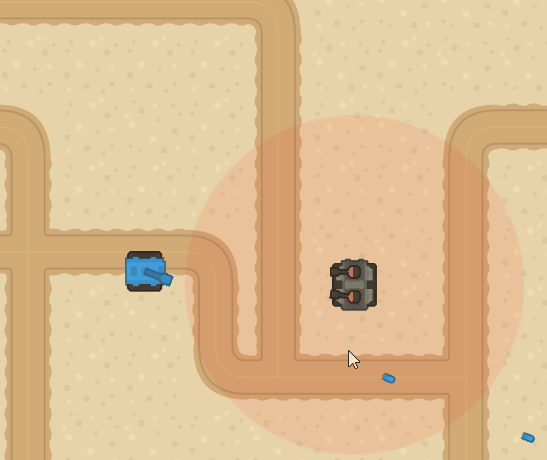

# Clase 4

## Reto #1

> Este reto no es calificable! Pero da bonificación extra! :gift:

1. Cree un script llamado ***TurretShooter*** y añadalo a la Torreta del [Taller #2](./../Taller-2-3#taller-2/).

2. Agregue el codigo necesario para que la torreta dispare al Player cuando este dentro de un rango establecido.
    - Hint: Investigue como calcular la distancia entre dos puntos :stuck_out_tongue: (`Vector.Distance` o `.magnitud`).

3. Los proyectiles que la Torreta dispare deben impactar SOLO con el Player (o el escenario).
    - Hint: Puede crear un nuevo prefab en base al proyectil del Player y cambiar la LayerMask (en caso que este usando Raycast) o jugar con las Layers.
    - Puede usar el siguiente [sprite](./Assets/).

4. Agregue el código necesario para que la torreta dispare cada X segundos, es decir, que **NO** dispare un proyectile cada frame!
    - Hint: puede crear un *timer* y usar `Time.deltaTime` para restar o sumar tiempo.

    ```c#    
    Update(){
        _timer -= Time.deltaTime; 
        if(_timer <= 0){
            //Do something
        }
    }

    ```

 	

### Reto del reto :trollface:

- Agregue un indicador para marcar el área de acción de la torreta (como el círculo rojo en el gif).
    - Hint: Utilice `transform.localScale` para modificar el tamaño de un objeto.


### Entrega
- Crear una branch a partir del branch `sessions/session-4`.
  - El nombre de la nueva branch debe tener el siguiente formato: `student/[usuario-unal]/session-4`
```
 Ejemplo: Si su correo es pedrito@unal.edu.co, la rama para hacer la entrega de la clase 3 debe ser `student/pedrito/session-4`.
```
- Hacer los commits necesarios para efectuar la solución al taller.
- Hacer un Pull Request de su branch (`student/[usuario-unal]/session-4`)
  - La branch target del PR debe ser `sessions/session-4`.
  - El nombre del PR debe seguir el formato `Solución Reto 1 - Clase 4  by [usuario-unal]`. 
```
 Ejemplo: Si su correo es pedrito@unal.edu.co, el título del PR debe ser: `Solución Reto 1 - Clase 4 by pedrito`.
```
  - Puede usar la descripción del PR para añadir notas, aclaraciones, preguntas, etc.