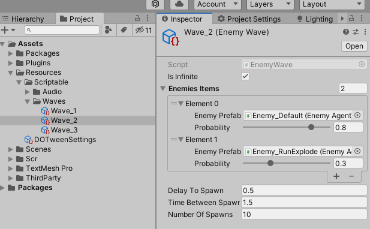
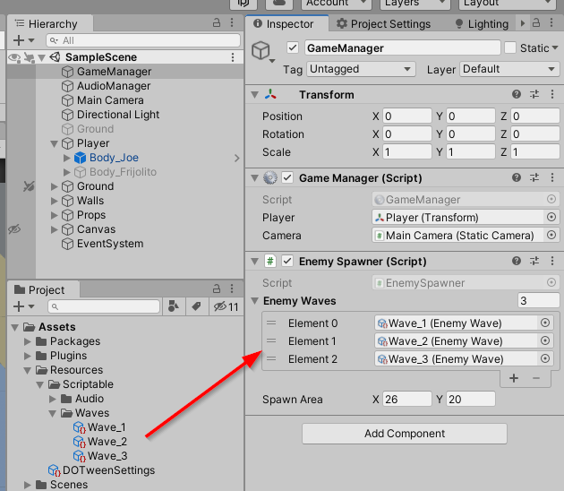
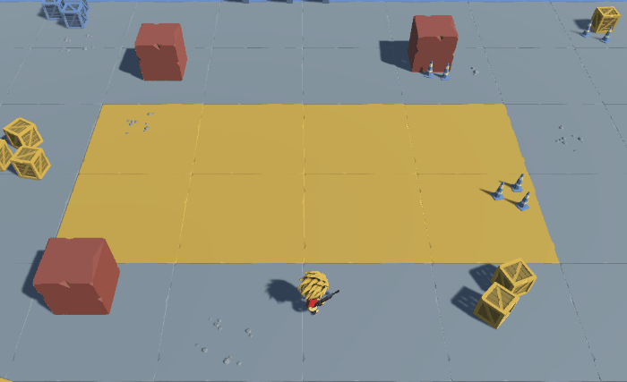
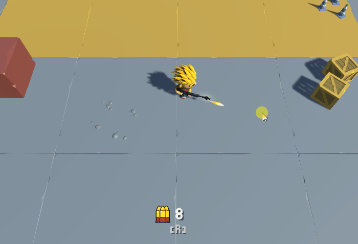
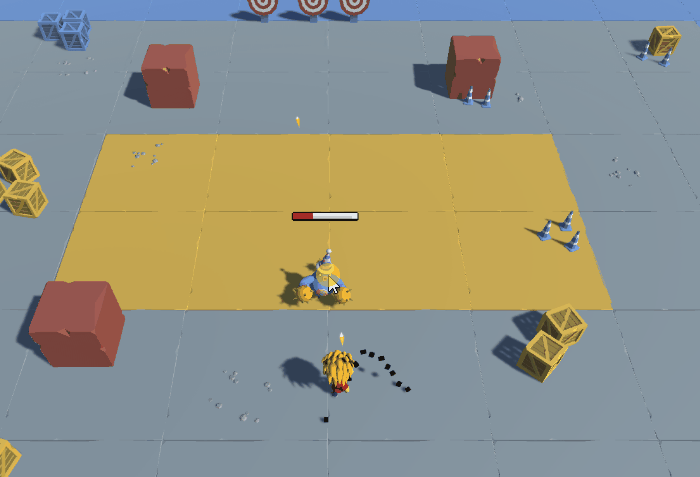
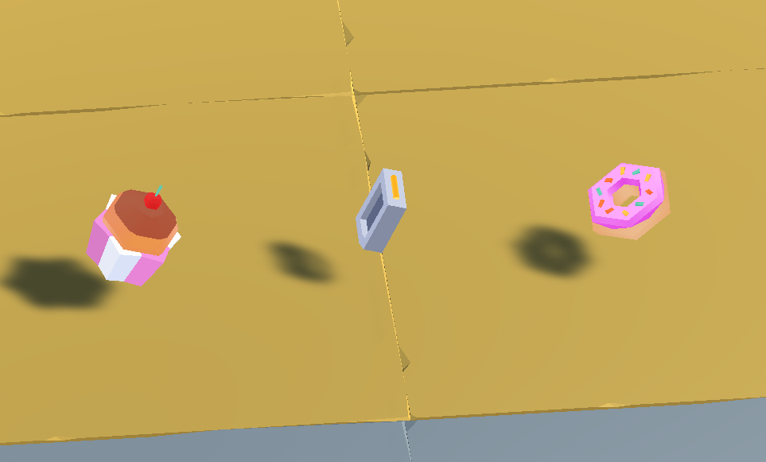
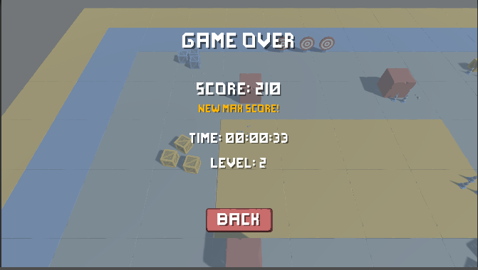

# Clase 13

## Reto #2

> Este reto da bonificación extra! (Compensa/Sube otra nota) :gift:

1. Agregue un sistema de "*oleadas*" de enemigos (o niveles, si así lo desea llamar).
  
    1. Cree un ScriptablesObject (o los que considere necesarios) que contenga la información de la "*oleada*"/nivel.
        - Recomendación, llamar al script ***EnemyWave***.
        - Por ejemplo, información como: cantidad de enemigos, cada cuanto se crea un enemigo, etc...
        - La última "*oleada*" (el último nivel) debe ser tipo *suvival*, es decir, se crean enemigos continuamente hasta que el Player muera.
    

    2. Actualice el script ***EnemySpawner*** para que utilice esta información de "*oleadas*" y se encargue de crear (instanciar) enemigos en base a la información de cada "*oleada*"/nivel.
        - Cuando el Player mate a todos los enemigos de una "*oleada*"/nivel, se debe seguir con la siguiente (si es la última, esta no tiene fin y continúa indefinidamente hasta que el Player muera).
        - Nota: deberá definir un sistema (función/método) para determinar la posición del nuevo enemigo a crear (instanciar).
            - Por ejemplo: Un punto aleatorio en el mapa, una lista de puntos predefinidos, etc...
            - Para obtener un punto aleatorio y asegurarse que esté dentro del NavMesh (es decir, que sea válido), puede usar [NavMesh.SamplePosition](https://docs.unity3d.com/ScriptReference/AI.NavMesh.SamplePosition.html).
    
    
    3. Actualice el StateMachine del Enemigo, para cuando el enemigo aparezca (sea instanciado), automáticament persiga al Player sin importar donde esté.
        - Por facilidad, no queremos usar el estado de ***Patrol*** ya que implica trabajo extra al crear enemigos dinámicamente. Por ahora solo queremos que ataquen directamente al player.
    
    4. **(Opcional)** Agregue un nuevo tipo de enemigo, que corra mucho más rapido y al estar cerca del Player, explote y haga daño en área.
        - Utilice el otro modelo 3D de enemigo tipo que se encuentra en el proyecto, así como sus animaciones.
    


2. Acutalice el script ***PlayerShooter*** con la mecánica de recargar.
    1. Agregue una cantidad de munición (balas). Cada vez que dispare, se gasta una munición (una bala). Si no tiene munición, no puede disparar.
    2. Cuando oprima la tecla **R**, debe recargar (restablecer la munición) después de X segundos (1 o 2 seg).
    3. Agregar la UI (HUD) necesaria para que muestre la cantidad de munición del Player.
        - Al menos un ícono y un texto.
    4. **(Opcional)** Agregue la animación de recarga (*reload*) al ***Animator*** del Player. Se debe activar cuando el Player esta recargando.
    

3. Agregue *drops* cuando un enemigo muera. Es decir, que el enemigo "*suelte*" ítems/loot luego de morir.
    1. Cuando el enemigo muera debe "*soltar*" al menos un drop. Es decir, instanciar un objeto "drop" en su posición.
    
    2. Cree los script necesarios para manejar la lógica de los drops. 
        - Cuando el Player toque el drop, debe desaparecer y ejecutar su correspondiente acción.
        - **Hint:** Utilice `OnTriggerEnter` para detectar cuando el Player y el Drop se tocan.
    3. Cree dos tipos de drop:
        - Puntaje: al tocarlo, da puntos extras.
        - Vida: al tocarlo, restablece un punto de vida al Player (restablece un corazón).
        - **(Opcional)** Cree más drop con otro tipo de acciones: Aumentar la munición, Mayor daño de ataque, bomba que explote después de 3 seg., etc.
    

4. Actualice la pantalla del final (Game Over) para que muestre: puntaje total, nivel ("*oleada*" de enemigos) en el que murió y tiempo total de juego.
    1. Esto implica agregar un sistema que cuente el tiempo de juego.
    


### Otras ideas - Más retos :trollface:

- Agregue un sistema de armas: diferentes tipos de disparo (burst, auto, single), diferentes *rate-fire*, más disparos al tiempo (tipo escopeta por ejemplo), diferentes tiempos de recarga, etc...
- Los enemigos, al morir, "*spawnen*" un enemigo minion (un nuevo enemigo).
- Agregue un Boss.
- Agregue más personajes jugables, con diferentes habilidades. Por ejemplo: ***Character Male*** con dash y ***Character Female*** con habilidad curación.
- Generación de mapa dinámica/procedural.

### Fecha de entrega
> Viernes 17 de Junio - 11:59 pm (media noche del viernes).

### Entrega
- Crear una branch a partir del branch `sessions/challenge-2`.
  - El nombre de la nueva branch debe tener el siguiente formato: `student/[usuario-unal]/challenge-2`
```
 Ejemplo: Si su correo es pedrito@unal.edu.co, la rama para hacer la entrega del reto 2 debe ser `student/pedrito/challenge-2`.
```
- Hacer los commits necesarios para efectuar la solución al taller.
- Hacer un Pull Request de su branch (`student/[usuario-unal]/challenge-2`)
  - La branch target del PR debe ser `sessions/challenge-2`.
  - El nombre del PR debe seguir el formato `Solución Reto 2 - Clase 13  by [usuario-unal]`. 
```
 Ejemplo: Si su correo es pedrito@unal.edu.co, el título del PR debe ser: `Solución Reto 2 - Clase 13 by pedrito`.
```
  - Puede usar la descripción del PR para añadir notas, aclaraciones, preguntas, etc.