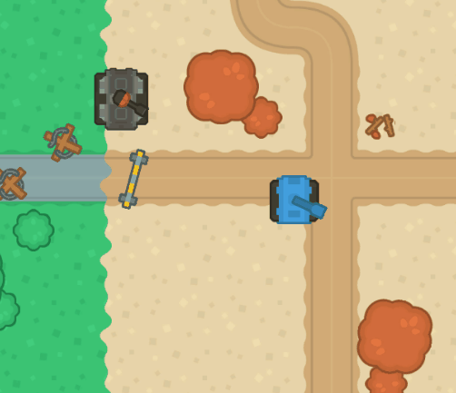
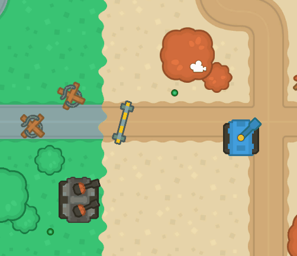

# Clase 3

## Taller #3

1. Agregue los assets al proyecto y agregue los objetos necesarios para añadir la torreta al juego.
    - Los assets los puede encontrar en el [drive](https://drive.google.com/drive/u/3/folders/1Pe-CPxChiM1NS_TnDOqJJMu0rX-0HIJy) o en el [repo](./Assets/).

2. Cree un script llamado ***TurretMovement*** y agregue el codigo necesario para que la torreta se mueva en un eje entre dos valores definidos.
    - Hint: Puede usar `Mathf.Clamp` para asegurar que el valor del eje (X o Y) siempre este dentro del límite establecido.

3. Actualice el script ***TurretMovement*** con el codigo necesario para que la torreta siempre mire al Player (tanque azul).
    - Hint: Recuerde como calcular la dirección de un punto a otro (`(target - init).normalized`).

 	

### Reto
1. Actualice el script ***TurretMovement*** para que use dos objetos vacios en vez de valores fijos en un eje.
    - Hint: Puede usar `Mathf.PingPong` y `Vector3.Lerp`.

2. Agregue más de una torreta al tanque.
    - Hint: Puede usar un array `Transform[] _turrets`. y un `for` para actualizar la rotación de cada una de ellas.

 	


### Fecha de entrega
> Viernes 08 de Abril - 11:59 pm (media noche del viernes).

### Entrega
- Crear una branch a partir del branch `sessions/session-3-tank`.
  - El nombre de la nueva branch debe tener el siguiente formato: `student/[usuario-unal]/session-3-tank`
```
 Ejemplo: Si su correo es pedrito@unal.edu.co, la rama para hacer la entrega de la clase 3 debe ser `student/pedrito/session-3-tank`.
```
- Hacer los commits necesarios para efectuar la solución al taller.
- Hacer un Pull Request de su branch (`student/[usuario-unal]/session-3-tank`)
  - La branch target del PR debe ser `sessions/session-3-tank`.
  - El nombre del PR debe seguir el formato `Solución Taller 3 - Clase 3 by [usuario-unal]`. 
```
 Ejemplo: Si su correo es pedrito@unal.edu.co, el título del PR debe ser: `Solución Taller 3 - Clase 3 by pedrito`.
```
  - Puede usar la descripción del PR para añadir notas, aclaraciones, preguntas, etc.