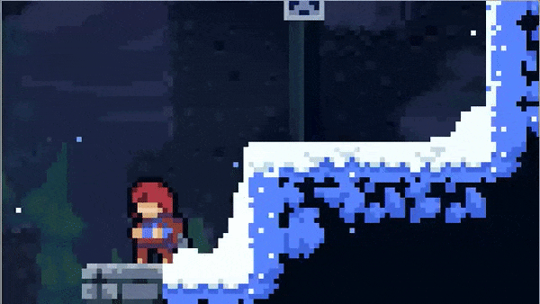

# Clase 5

## Taller #4

1. Agregue el código necesario para que el personaje (*Frijolito*) ejecute un **Dash** cuando oprima la tecla ***Shift***.
    - **Dash**: Desplazarse una distancia considerable en un tiempo corto. Ejemplo: *Hollow Knight* o *Celeste*
        

> Hay muchas formas de implementar un dash, resultando en una sensación diferente. A continuación dos sugerencias:
- Aplicar una velocidad muy alta en un tiempo muy limitado. Esto da como resultado un dash instantaneo y rápido.
    - Hint: utilice un timer (variable al que resta/suma `Time.deltaTime`).
    
    
- Aplicar una velocidad en base a una distancia y una resistencia. Esto da como resultado un dash más progresivo y no tan rápido.
    

2. Implemente el sistema de disparo que teniamos en 2D (tanks).
    - Cree los script `PlayerShooter` y `Projectile`. Implemente el código respectivo en cada uno.
    - En la escena encontrará que el player ya tiene una arma.
    - En la escena encontrará un objeto llamado ***Bullet***. Utilice esto como proyectil. 
        - Hint: Posiblemente necesitará crear un Prefab a partir de este.

    

3. Agregue el código necesario al script `Projectile`  para que el proyectil desaparezca despues de X segundos.
    - Hint: Puede utilizar un timer. También puede buscar las opciones que tiene la funcion `Destroy`.


### Reto
1. Agregue el código necesario para que el personaje (*Frijolito*) ejecute un **Salto** cuando oprima la tecla ***Space***.
    

2. Agregue el código necesario al script `PlayerShooter` para añadir un *fire-rate* (disparar un bala cada X sec.) y que puede disparar continuamente dejando oprimido el click del mouse.
    - Hint: Recuerde el `GetButton`, `GetButtonDown` y `GetButtonUp` para registrar los inputs.
    - Hint: De nuevo, timers (variable al que resta/suma `Time.deltaTime`) :stuck_out_tongue: 

    


### Fecha de entrega
> Viernes 22 de Abril - 11:59 pm (media noche del viernes).

### Entrega
- Crear una branch a partir del branch `sessions/homework-4`.
  - El nombre de la nueva branch debe tener el siguiente formato: `student/[usuario-unal]/homework-4`
```
 Ejemplo: Si su correo es pedrito@unal.edu.co, la rama para hacer la entrega de la clase 3 debe ser `student/pedrito/homework-4`.
```
- Hacer los commits necesarios para efectuar la solución al taller.
- Hacer un Pull Request de su branch (`student/[usuario-unal]/homework-4`)
  - La branch target del PR debe ser `sessions/homework-4`.
  - El nombre del PR debe seguir el formato `Solución Taller 4 - Clase 5 by [usuario-unal]`. 
```
 Ejemplo: Si su correo es pedrito@unal.edu.co, el título del PR debe ser: `Solución Taller 4 - Clase 5 by pedrito`.
```
  - Puede usar la descripción del PR para añadir notas, aclaraciones, preguntas, etc.