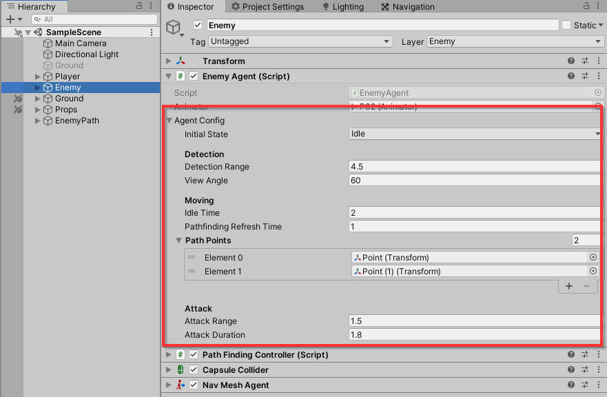
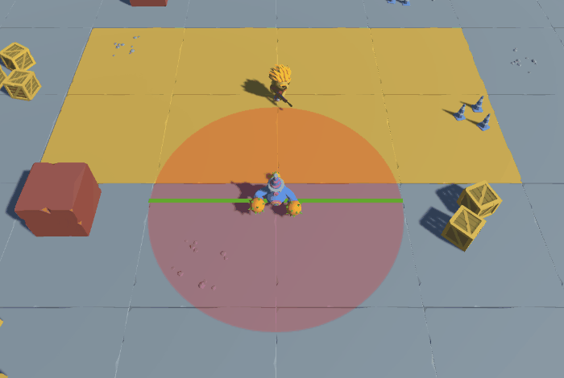
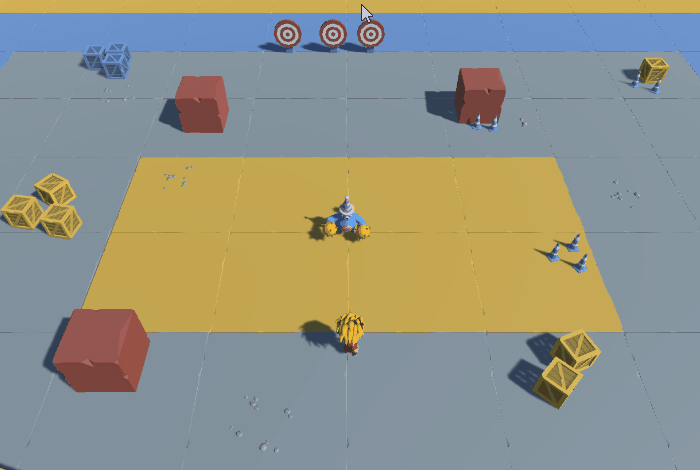
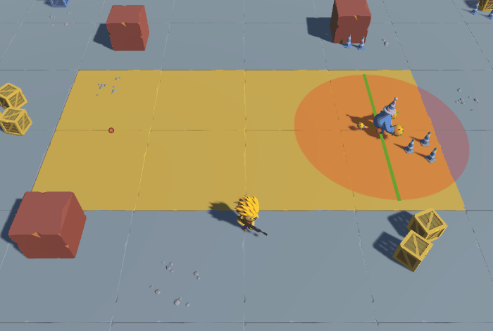
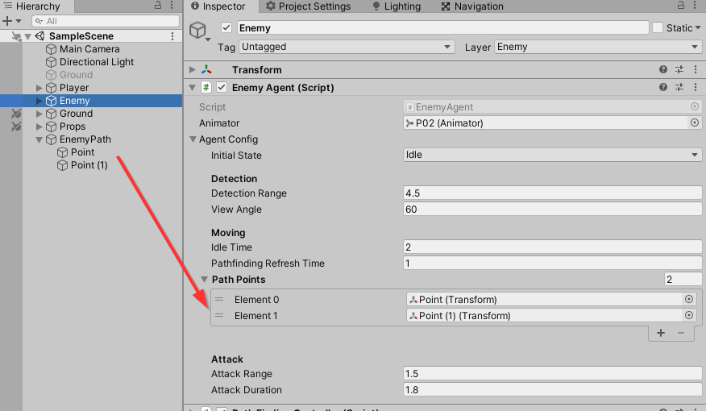
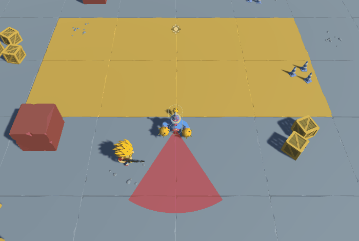
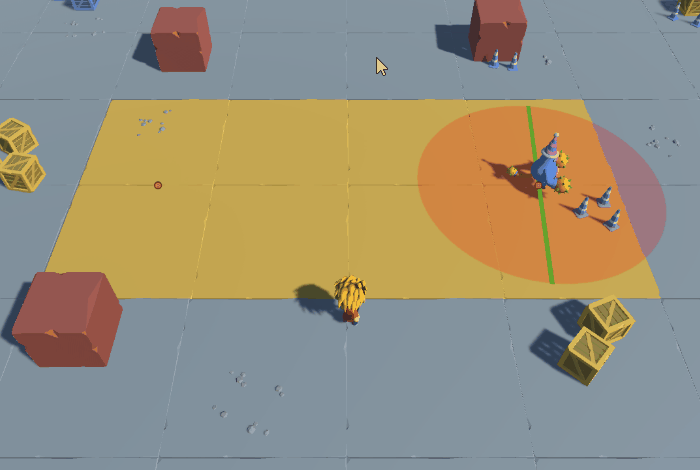

# Clase 7

## Leer antes de realizar el taller!

> Se ha agregado al script enemigo una serie de atributos llamados *Agent Config*. 
> Se espera que use estos valores en los diferentes puntos del taller. Por ejemplo, notará que la función `IsLookingTarget` ahora usa el valor `AgentConfig.DetectionRange` en vez del valor `5f`.

```c#
    public bool IsLookingTarget()
    {
        return (_target.position - transform.position).magnitude < AgentConfig.DetectionRange;     
    }
```


## Taller #5

1. Actualice la función `IsLookingTarget` (en el script `EnemyAgent`) para detecte al Player solo cuando este en frente del enemigo.
    - Hint: Puede usar el Producto punto (Vector3.Dot) entre la dirección al Player y el Forward del Enemigo.
        

2. Cree y agregue el estado *Ataque* al Enemigo
    - Cree el script `EnemyAttackState` utilizando lo visto en clase.
    - Después de X segundos, debe volver al estado *Idle*.
        - Use el valor `AttackDuration` de la configuración del enemigo (*Agent Config*).
    - Active la animación de Ataque.
        - Hint: Active la animación usando el siguiente código. **Nota:** Todo lo relacionado a las animaciones y al Animator ya debe estar en su lugar, así que no debería que tener la necesidad de editar algo relacionado a esto. Solo es activar la trasnsición
        ```c#
        agent.Animator.SetTrigger("Attack");
        ```
        - Hint 2: Tal vez sea un buen caso para usar el *OnEnter*? :wink:
    - No olvide agregar el estado al Finite-State Machine (script `StateMachineController`).
    

3. Actualice el estado *Idle* para que cambie al estado *Patrol* luego de X segundos.
    - Usar el valor `IdleTime` para controlar este tiempo (ver nota al inicio sobre *Agent Config*).

4. Cree y agregue el estado *Patrol* al Enemigo
    - Cree el script `EnemyPatrolState` utilizando lo visto en clase.
    - El enemigo debe de ir al siguiente punto de patrullaje. Esperar X segundos. Y luego ir al siguiente punto de patrullaje.
        - Hint: Puede controlar ese tiempo de espera desde el mismo estado de *Patrol* o pueden hacer que vuelva a Idle (?)
    - Utilice la lista de puntos `PathPoints` de la configuración del Enemigo (*Agent Config*) para obtener siguiente punto de patrullaje al cual debe ir.
        - Hint: Código sugerido para obtener el siguiente punto de patrullaje.
    ```c#
    private int _currentPointIndex = 0;

    private Vector3 GetAgentNextPoint(EnemyAgent agent)
    {
        //If we don't have a Path return (0, 0, 0)
        if (agent.AgentConfig.PathPoints == null || agent.AgentConfig.PathPoints.Count == 0)
        {
             return Vector3.zero;
        }
        
        //Move through the path. When reach the end -> start from 0 again
        _currentPointIndex = (_currentPointIndex + 1) % agent.AgentConfig.PathPoints.Count;
        return agent.AgentConfig.PathPoints[_currentPointIndex].position;
    }
    ```
    - Obviamente utilice el *PathFindingController* para el movimiento del Enemigo.
        - Recuerde detener el PathFinding cuando cambie de estado (revisar el `OnExit` del estado *Chase*).
    - No olvide agregar el estado al Finite-State Machine (script `StateMachineController`).
    

Aclaración:

> Los puntos del patrullaje (la variable `PathPoints` de la configuración del enemigo) son solo objetos vacios en la escena. Puede agregar o cambiarlos de posición si así lo desea.


### Reto

1. Actualice la función `IsLookingTarget` (en el script `EnemyAgent`) para detecte al Player solo cuando este dentro del cono de vision del Enemigo.
    - Hint: Aunque es viable usar el Producto punto (Vector3.Dot), la idea es obtener el ángulo entre el Player y el Enemigo y comparlo con el valor `ViewAngle` de la configuración del enemigo (ver nota al inicio sobre *Agent Config*).
        

2. Actualice el estado *Ataque* (Punto #2) para que el Enemigo siempre este mirando al Player.

3. Actualice el estado *Patrol* (Punto #4) para que cambie al estado *Chase* si el Player esta en su rango de visión.
    - Hint: Utilice la función `IsLookingTarget`.
        


### Fecha de entrega
> Viernes 13 de Mayo - 11:59 pm (media noche del viernes).

### Entrega
- Crear una branch a partir del branch `sessions/homework-5`.
  - El nombre de la nueva branch debe tener el siguiente formato: `student/[usuario-unal]/homework-5`
```
 Ejemplo: Si su correo es pedrito@unal.edu.co, la rama para hacer la entrega de la tarea #5 debe ser `student/pedrito/homework-5`.
```
- Hacer los commits necesarios para efectuar la solución al taller.
- Hacer un Pull Request de su branch (`student/[usuario-unal]/homework-5`)
  - La branch target del PR debe ser `sessions/homework-5`.
  - El nombre del PR debe seguir el formato `Solución Taller 5 - Clase 7 by [usuario-unal]`. 
```
 Ejemplo: Si su correo es pedrito@unal.edu.co, el título del PR debe ser: `Solución Taller 5 - Clase 7 by pedrito`.
```
  - Puede usar la descripción del PR para añadir notas, aclaraciones, preguntas, etc.